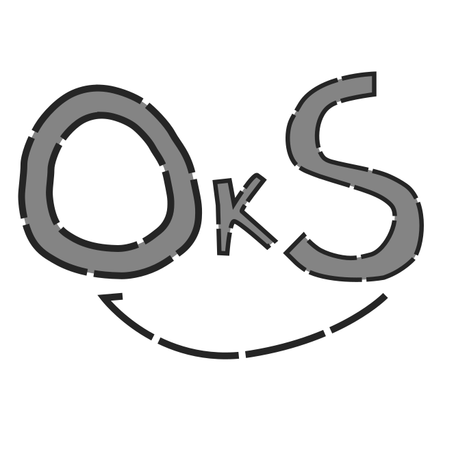

# OkServer!
_OkServer!_, or _OkS!_ for short, is a Go-based HTTP web server aimed to be lightweight, clean, and straightforward.


## Installation
1. Run ```git clone https://github.com/OkSProject/OkServer.git```
2. Run ```cd OkServer```
3. Run ```go run ./server.go```

## To be worked on...
- Serve PHP, Python, and Go files.
- Ability to manage use/manage database(s).
- Ability to create .conf files for individual sites.
- Service to allow OkS! to run in background.

## Credits
_OkServer!_ and the _OkS!_ Project were started by Cole Rathbun (@cbrbygones), and is licensed under GPLv3 for anyone to use, modify, and redistribute.
